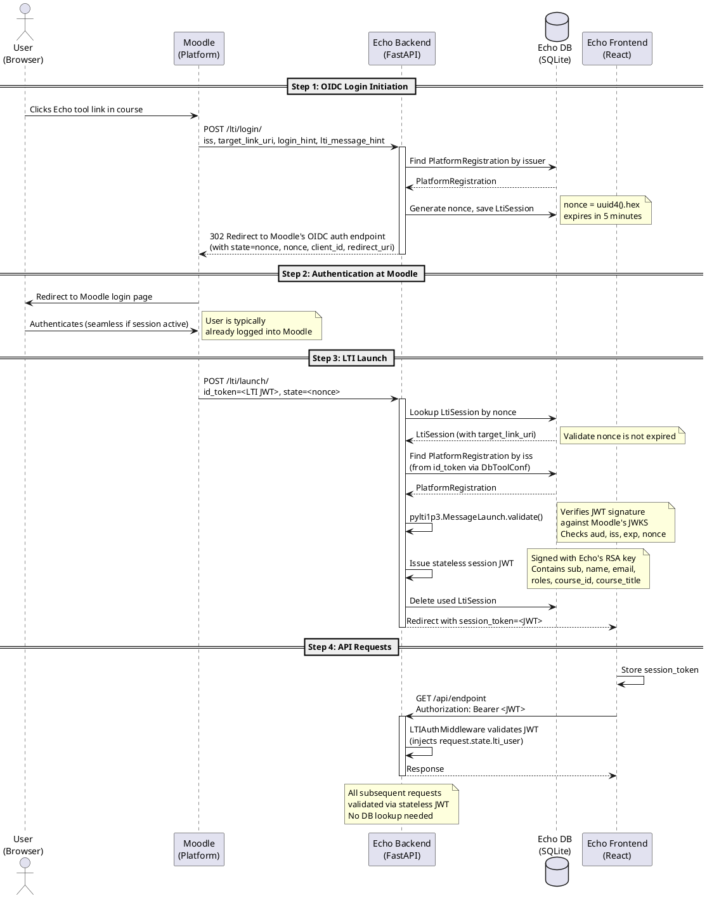

# LTI Launch Flow Diagram

This document contains the PlantUML sequence diagram for the LTI 1.3 launch flow between Moodle (Platform) and Echo (Tool).

## Diagram

## Source File

The raw PlantUML file is at `lti_launch_flow_diagram.puml`.

Render it at [plantuml.com](https://www.plantuml.com/plantuml/uml/) or with any PlantUML CLI tool.
